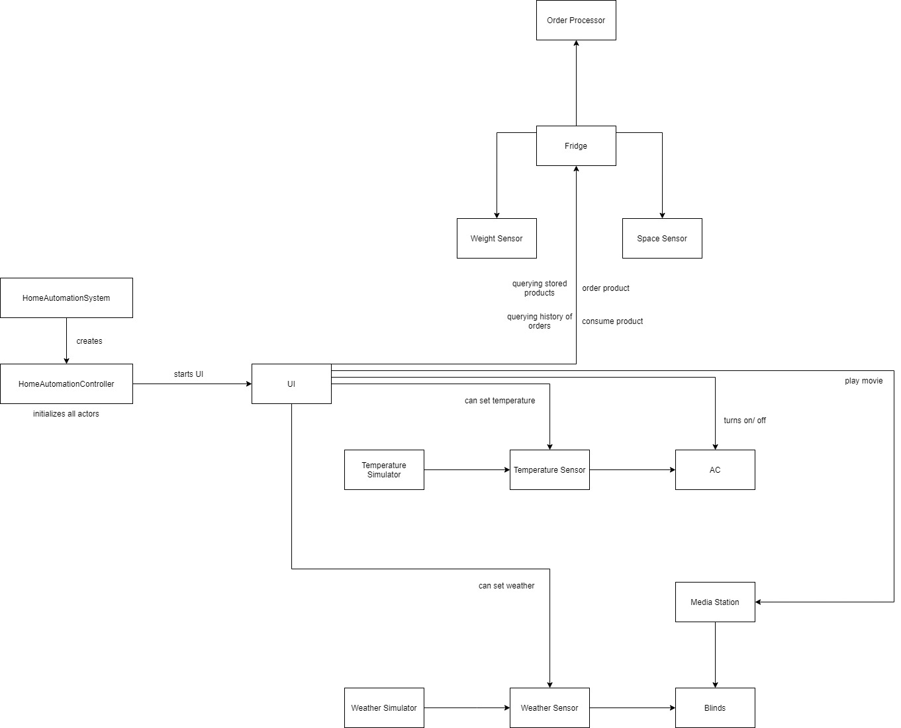
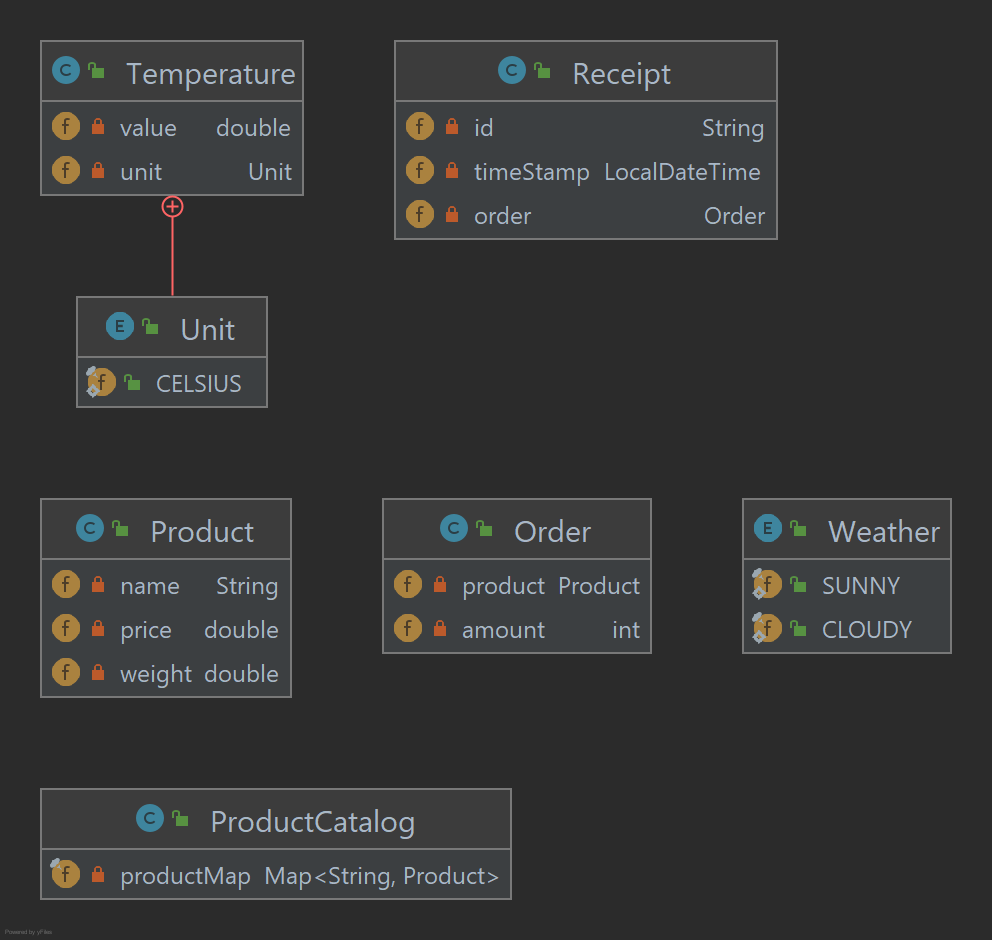
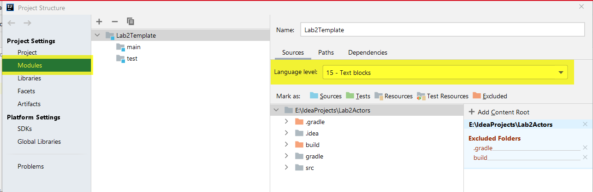

# Lab 2 (Actor-based Home Automation)

Bei diesem Projekt handelt es sich um ein mit **Akka** implementiertes Home Automation System.
Zunächst wird die grundlegende Architektur vorgestellt. Anschließend wird näher auf die 
jeweiligen Actors und deren Interaktionsmuster mit den anderen Actors des Systems eingegangen.
Anschließend folgt die Vorstellung der verwendeten Domänenobjekten, sowie eine Nutzungsanleitung
inklusive beispielhafte Testfälle.

Github Repo ist verfügbar unter: https://github.com/bianca482/Lab2Actors

## 1. Architektur
Die im Projekt verwendete Architektur beruht auf den auf der Akka-Homepage beschriebenen Vorgehensweise.
Dabei hat jeder Actor ein bestimmtes Verhalten, welches durch Commands beschrieben wird. Ein Actor
hat ein jeweils direkt in der Klasse definiertes Interface was den Vorteil hat, auf einen Blick 
sehen zu können, welches Command zu welchem Actor gehört. Die Commands implementieren jeweils dieses
Interface und können daher immer dem jeweiligen Actor zugeordnet werden.
Wenn sich der Zustand eines Actors verändert, ändert sich auch sein Verhalten. Wenn ein Gerät beispielsweise 
komplett ausgeschalten wird, d.h. von der Stromversorgung getrennt wird, kann es nur noch 
ein Command entgegennehmen; nämlich sich wieder einzuschalten.

In diesem Projekt werden alle Actors im *HomeAutomationController* initialisiert, kommunizieren aber sonst
direkt miteinander. Der *HomeAutomationController* ist in diesem Fall ein Guardian, da er alle
anderen Actors initialisiert und diese auch beendet werden, wenn der Controller beendet wird.
Das **Blackboard-Pattern** wäre eine gute Möglichkeit gewesen, die Actors 
voneinander zu entkoppeln. Dabei könnten alle Actors ihre Nachrichten direkt an das Blackboard 
schicken, welches wiederrum die Nachrichten an den gewünschten Empfänger weiterleitet. 
Da jedoch der Großteil der Applikation bereits vor der Vorstellung des Blackboard-Patterns 
implementiert wurde, erwies sich der Aufwand als zu groß, um dieses nachträglich fristgerecht
einbauen zu können.

## 2. Verwendete Actors und deren Kommunikation
Im diesem Abschnitt werden die verschiedenen Actors des Systems mitsamt
ihrer Kommunikation beschrieben. Die folgende Abbildung bietet
einen Überblick darüber, welche Actors es gibt und wer mit wem kommuniziert.

In der Abbildung ist ersichtlich, dass das System über die Klasse *HomeAutomationSystem*
gestartet wird. Diese erstellt einen *HomeAutomationController*, welcher
alle Actors des Systems erstellt. Der *HomeAutomationController* schickt
außerdem eine Nachricht an den *UI*-Actor, damit dieser einen neuen Thread mit
startet und der User somit Befehle eingeben kann.

### 2.1 UI
Das *UI* nimmt die Anfragen des Users entgegen und sendet diese an die
entsprechenden Actors weiter.

Über das *UI* ist es somit z.B. möglich, den *Fridge* anzusprechen und somit
Produkte zu bestellen, zu konsumieren, sowie auch die Produkte, die sich aktuell
im Kühlschrank befinden, als auch eine Historie der Bestellungen ausgeben zu lassen.
Zudem kann der *AC* manuell ein- und ausgeschaltet werden. Außerdem kann der User Filme
abspielen sowie die Temperatur und das Wetter manuell setzen.
- #### Eingesetzte Interaktions-Pattern
Das *UI* kennt alle Aktoren, die vom User direkt angesprochen werden können. Dies sind 
der *Fridge*, *AC*, *MediaStation*, *TemperatureSensor* und *WeatherSensor*. Die Nachrichten werden
rein technisch gesehen jeweils über das "Fire and Forget"-Pattern verschickt, da das *UI* lediglich die Schnittstelle zwischen
dem User und den einzelnen Devices ist. Die Responses der Devices werden als Konsolenlogs ausgegeben,
was eine Art von "Request-Response" darstellt, da der User eine Nachricht von den Devices bekommt, diese
aber nicht direkt über den *UI*-Actor abgefangen werden. 

### 2.2 MediaStation
Über die *MediaStation* kann ein Film abgespielt werden. 
- #### Eingesetzte Interaktions-Pattern
Diese schickt nach dem "Fire and Forget"-Ansatz den *Blinds* Nachrichten. 
Dabei wird den *Blinds* mitgeteilt, ob aktuell gerade ein Film läuft oder nicht. Dieses Pattern wurde
verwendet, da die *MediaStation* keine Antwort von den *Blinds* braucht und auch nicht wissen muss, 
ob diese ihre Anfrage erhalten hat. Die *MediaStation* gibt den *Blinds* lediglich Bescheid, ob gerade
ein Film läuft oder nicht - was mit diesen Informationen passieren soll, entscheiden die *Blinds*.

### 2.3 TemperatureSimulator
Der *TemperatureSimulator* schickt sich nach einem selbstgewählten
Timeout immer selbst Nachrichten. Wenn das Timeout erreicht wurde, wird
die Temperatur um einen zufälligen Wert im Bereich von -1 bis +1 Grad erhöht/verringert
und die neue Temperatur dem *TemperatureSensor* übermittelt.
- #### Eingesetzte Interaktions-Pattern
Um diesen *TemperatureSimulator* implementieren zu können, wurde das Interaktions-Pattern 
"Scheduling messages to self" verwendet. Dieses Pattern ermöglicht es einem Actor sich 
selbst Nachrichten zu schicken. Dafür wird ein Timeout definiert, nach dessen Ablauf die 
Nachricht versendet wird. 
Die Kommunikation zwischen diesem Simulator und dem Sensor erfolgt dabei über das Pattern 
"Fire and Forget". Der Simulator kennt daher den Sensor und pushed die neue Temperatur einfach 
auf den Sensor. Es wurde auf dieses Pattern zurückgegriffen, weil der Simulator nichts anderes tut, 
als die Temperatur zu erzeugen und es ihm auch egal ist, was der Sensor dann damit macht. 

### 2.4 TemperatureSensor
Bekommt vom *TemperaturSimulator* oder vom *UI* eine Temperatur zugeschickt.
- #### Eingesetzte Interaktions-Pattern
Der *TemperatureSensor* kennt nur den *AC* und schickt diesem nach dem
Interaktions-Pattern "Fire and Forget" immer die neue aktuelle Temperatur. Das "Fire and Forget"-
Pattern wurde wieder verwendet, da der *TemperatureSensor* nicht wissen muss, wie und ob 
der *AC* auf die Nachricht reagiert.

### 2.5 AC
Der *AC* erhält Nachrichten vom *TemperatureSensor* und schaltet sich je nach Temperatur
ein- bzw. aus. Zusätzlich kann dieser Actor auch von außen komplett ausgeschalten werden.
Per Default läuft der *AC* zwar, ist aber auf Standby geschalten (= kühlt nicht).
Ist dieser Actor komplett ausgeschalten, ändert sich sein Verhalten. Er kann dann nur noch
ein einzelnes Command entgegennehmen, und zwar, ob er wieder eingeschalten werden soll.
- #### Eingesetzte Interaktions-Pattern
Kennt keinen anderen Actor. 

### 2.6 WeatherSimulator
Bei dem *WeatherSimulator* verhält es sich genau gleich wie beim *TemperatureSimulator*, nur 
mit dem Unterschied, dass dieser Simulator zufällig ein Wetter generiert.
- #### Eingesetzte Interaktions-Pattern
Auch hier wurde das Pattern "Scheduling messages to self" implementiert,
damit in einem Intervall immer wieder ein neues Wetter generiert wird. Das Wetter
wird wieder nach dem "Fire and Forget"-Ansatz dem *WeatherSensor* weitergeschickt.

### 2.7 WeatherSensor
Bekommt vom *WeatherSimulator* ein Wetter.
- #### Eingesetzte Interaktions-Pattern
Der *WeatherSensor* kennt die *Blinds* und pushed das aktuelle Wetter
auf die *Blinds* (= "Fire and Forget").

### 2.8 Blinds
Die *Blinds* bekommen von der *MediaStation* und dem *WeatherSensor* Nachrichten 
zugeschickt. Je nachdem, welche Werte übermittelt wurden, ändert sich der Öffnungszustand 
der *Blinds*.
- #### Eingesetzte Interaktions-Pattern
Kennt keinen anderen Actor.

### 2.9 Fridge
Der *Fridge* hat selber zwei eigene Sensoren, den *WeightSensor* und den *SpaceSensor*.
Diese werden beim Erstellen des Kühlschranks initialisiert und erhalten somit auch
die maximale Anzahl an Produkten bzw. das mögliche Maximalgewicht. Im Falle der 
Bearbeitung einer "OrderProduct"-Anfrage vom *UI* wird dabei zunächst bei
den beiden Sensoren angefragt, ob vom Gewicht bzw. von der Anzahl der Produkten
her die Bestellung durchgeführt werden kann. Der *Fridge* wartet, bis beide Sensoren
geprüft haben, ob die Bestellung von ihrer Seite aus durchgeführt werden kann.
Ist die Bestellung möglich, wird ein "Per session child Actor" namens *OrderProcessor* 
erstellt, welcher die Bestellung abschließt.
Falls ein gerade konsumiertes Produkt das letzte seiner Art war, bestellt der *OrderProcessor* dieses Produkt gleich nach.
Auch in diesem Fall prüfen zunächst die Sensoren, ob die Bestellung durchgeführt werden kann.

#### 2.9.1 WeightSensor und SpaceSensor
Beide Sensoren bekommen jeweils einen Request vom *Fridge*, bearbeiten die Anfrage und 
schicken dem *Fridge* eine Antwort zurück. Hierbei wurde auf das "Request and Response"-Interaktionspattern zurückgegriffen,
weil der *Fridge* wissen muss, dass die Anfragen auch von den Sensoren bearbeitet wurden. 
Er braucht die Antwort von beiden, um z.B. eine Bestellung weiter bearbeiten zu können.
#### 2.9.2 OrderProcessor
Wird als "Per session child Actor" vom *Fridge* erstellt und erhält auf diesen entsprechend
auch eine Referenz. Er erstellt eine passende Rechnung, welche er dem *Fridge"* zurückschickt.
Dieser Actor wurde als "Per session child Actor" implementiert, da ein Bestellvorgang immer
von mehreren Interaktionen mit anderen Actors (= Weight- & SpaceSensor) abhängt. Er wird für jeden
Bestellvorgang neu erstellt, da dieser Actor immer mit dem aktuellen Order initialisiert wird.
Um den *Fridge* etwas leichter/ schmaler zu gestalten, wäre es vermutlich besser gewesen, dem *OrderProcessor*
beide Sensoren mitzugeben. Dies hätte  den Vorteil gehabt, den gesamten Bestellvorgang über diesen Actor abwickeln zu können.
In unserem Fall macht dieser Actor nichts anderes, als das Receipt zu erstellen.

## 3. Domain Model
Neben den soeben beschriebenen Actors, kamen auch normale Java Klassen zum Einsatz.

Wie in der obigen Abbildung ersichtlich ist, wurde eine eigene Klasse für die *Temperature* erstellt
Dies hat den Sinn, zusätzlich zur jewiligen Grad-Anzahl auch die entsprechende Einheit
speichern zu können. Hierfür hat die *Temperature* eine interne Enum-Klasse, welche aktuell nur
Grad Celsius enthält. Diese könnte auch durch andere Maßeinheiten, wie beispielsweise Kelvin oder
Fahrenheit, erweitert werden.

Ein *Product* kann bestellt oder konsumiert werden. Jedes *Product* hat einen Namen, einen
Preis und ein Gewicht. Der *ProductCatalog"* speichert alle möglichen Produkte, die in einem
*Fridge* gespeichert werden können. Jeder Fridge erstellt sich einen *ProductCatalog*.
Dies Klasse wurde eingefügt, um nicht extra bei jedem Produkt, das im *UI* bestellt oder
konsumiert wird, einen Preis und ein Gewicht bereitstellen zu müssen. Die Produkte werden zu Beginn
initialisiert und können aber im Nachhinein über das "AddProductToCatalog"-Command des *Fridge*
erweitert werden.

Eine *Order*-Klasse wurde erstellt, um sich einen Verlauf der Bestellungen anzeigen lassen zu können.
Beim Erstellen einer Bestellung wird ein neues *Order*-Objekt angelegt und in einer Liste im *Fridge* gespeichert.

Wurde eine Bestellung erfolgreich abgeschlossen, wird ein *Receipt*-Objekt erstellt. In dieser ist nicht nur
ersichtlich, was bestellt wurde, sondern auch zu welchem Zeitpunkt.

Das *Weather* ist ein einfaches Enum, welches aktuell nur aus "sunny" und "cloudy" besteht. Dies wurde
als Enum implementiert, da keine weiteren Attribute notwendig sind und auf diese Art und Weise
auch nachträglich leicht weitere Wetterzustände gespeichert werden könnten.

## 3. Verwendung Applikation

Für die Nutzung der Applikation wird Java Version 15 oder höher benötigt. Darauf ist zu achten, dass die Version in den Project Settings unter Modules hinterlegt ist:

### 3.1 Bedienung UI
Um die Applikation zu bedienen, muss zuerst das *HomeAutomationSystem* gestartet werden.
Im Anschluss können über die Kommandozeile Commands eingegeben werden, welche vom *UI* entgegengenommen und an die zuständigen Actors weitergeleitet werden.
Folgend werden die bereitgestellten Commands aufgelistet und beschrieben, wie diese verwendet werden können, um die Applikation zu bedienen.

#### 3.1.1 Temperatur verändern:
- Anforderung: environmental temperature which is changing over time is controlled through a temperature simulator
- Command: *t [temperature]*
  - Example: *t 23*
  - Example: *t 12.4*
  - Example: *t 10.00*

Mit *"t"* wird angedeutet, dass die Umgebungstemperatur verändert werden soll.
Die Temperatur muss als Zahl angegeben werden und entspricht der Einheit "Grad Celsius".
Die Einheit wird automatisch angehängt.
Da die Temperatur über einen *TemperatureSimulator* gesteuert wird, ist des nicht nötig, dieses Command händisch auszuführen, es wurde aber für Testzwecke implementiert.

#### 3.1.2 AC ein- oder ausschalten:
- Command: *a [true/false]*

Mit *"a"* wird angedeutet, dass die AC bedient werden soll.
Mit *[true]* kann die AC eingeschaltet, mit *[false]* kann sie ausgeschalten werden.

#### 3.1.3 Mediastation bedienen:
- Anforderung: Users can play movies at the media station.
- Command: *m [true/false]*

Mit *"m"* wird angedeutet, dass die Media Station bedient werden soll.
Mit *[true]* kann ein Film gestartet werden, mit *[false]* kann ein Film gestoppt werden.

#### 3.1.4 Wetter verändern:
- Anforderung: weather conditions which are changing over time are controlled through a weather simulator
- Command: *w [sunny/cloudy]*

Mit *"w"* wird angedeutet, dass das Wetter verändert werden soll.
Die Wettersituation kann mit *[sunny]* auf sonnig und mit *[cloudy]* auf wolking geändert werden.
Da das Wetter über einen *weatherSimulator* gesteuert wird, ist des nicht nötig, dieses Command händisch auszuführen, es wurde aber für Testzwecke implementiert.

#### 3.1.5 Kühlschrank bedienen:
Um den Kühlschrank zu bedienen, wurde bei der Initialisierung des Kühlschranks ein Default-Produktkatalog erstellt der folgende Artikel enthält:
milk, cheese, yogurt, butter, chicken, coke, salad.
Diese Produkte können bestellt und konsumiert werden. Sollten andere Produkte bestellt oder konsumiert werden wollen, können diese manuell hinzugefügt werden.

**Produkt zum Produktkatalog hinzufügen:**
- Command: *f catalog*

Mit *"f"* wird angedeutet, dass der Kühlschrank angesprochen werden soll und mit *"catalog"*, dass ein Produkt zum Produktkatalog hinzugefügt werden soll.
Daraufhin erscheint die Meldung, dass *[name] [price] [weight]* des Produktes, welches hinzugefügt werden will, eingegeben werden soll.

- Command: *[name] [price] [weight]*
    - Example: *egg 3 0.2*
    - Example: *ketchup 1.99 0.30*
    
Dem Produkt kann ein beliebiger Name, ein beliebiger Preis als Zahl und ein beliebiges Gewicht als Zahl mitgegeben werden.

**Produkt bestellen:**
- Anforderung: Users can order products at the Fridge.  A successful order returns a receipt.
- Command: *f order [name] [Optional amount]*
    - Example: *f order milk*
    - Example: *f order yogurt 4*
    
Mit *"order"* wird angedeutet, dass eine Produkt-Bestellung aufgegeben werden soll.
Dazu muss der Produktname angegeben werden. Zusätzlich kann die zu bestellende Menge angegeben werden, wird diese nicht angegeben, wird das Produkt automatisch 1x bestellt.

**Produkt konsumieren:**
- Anforderung: Users can consume products from the Fridge.
- Command: *f consume [name] [Optional amount]*
    - Example: *f consume milk*
    - Example: *f consume yogurt 4*

Mit *"consume"* wird angedeutet, dass ein Produkt konsumiert werden soll.
Dazu muss der Produktname angegeben werden. Zusätzlich kann die zu konsumierende Menge angegeben werden, wird diese nicht angegeben, wird das Produkt automatisch 1x konsumiert.

**Im Kühlschrank befindliche Produkte ausgeben:**
- Anforderung: The Fridge allows for querying the currently stored products.
- Command: *f products* 
  
Mit *"products"* wird eine Liste an Produkten ausgegeben, welche sich aktuell im Kühlschrank befinden.

**Bestellhistorie ausgeben:**
- Anforderung: The Fridge allows for querying the history of orders.
- Command: *f orders*

Mit *"orders"* wird eine Historie der erfolgreich durchgeführten Bestellungen ausgegeben.

### 3.2  Testfälle:

Bei den Testfällen wird davon ausgegangen, dass die Commands korrekt (ohne Tippfehler und in der richtgien Reihenfolge) eingegeben werden.
Ein Fehlerhandling für falsch eingegebene Commands wurde nicht implementiert.

#### 3.2.1 Users can order products at the Fridge. A successful order returns a receipt.
User möchte sechs Jogurt bestellen. Der maximale Platz und das maximal tragende Gewicht des Kühlschranks ist noch nicht erreicht.
- Command: *f order yogurt 6*
- Resultat: Es wird 6x Joghurt bestellt und eine Bestellbestätigung ausgegeben.

User möchte 101x Joghurt bestellen. Der maximale Platz des Kühlschranks würde dadurch überschritten werden, das maximal tragende Gewicht jedoch nicht.
- Command: *f order yogurt 101*
- Resultat: Die Bestellung kann nicht durchgeführt werden
- Bestätigte Regel: The Fridge can only process an order if there is enough room in the fridge, i.e., the contained products and newly order products do not exceed the maximum number of storable products.

User möchte 3x Rindfleisch bestellen. Das maximal tragende Gewicht des Kühlschranks würde dadurch überschritten werden, der maximale Platz jedoch nicht.
- Command: *f order beef 3*
- Ergebnis: Rückmeldung, dass das Produkt Yoghurt nicht geordert werden kann, weil das maximale Gewicht sonst überschritten wird.
- Bestätigte Regel: The Fridge can only process an order if the weight of the sum of the contained products and newly order products does not exceed its maximum weight capacity.

User möchte Produkt bestellen, welches sich nicht im Kühlschrank befindet.
- Command: *f order honey*
- Resultat: Bestellung nicht möglich, da das das Produkt nicht verfügbar ist.

User möchte Produkt bestellen, welches sich nicht im Kühlschrank befindet und legt dieses somit im Produktkatalog an.
- Command: *f catalog, honey 5.00 0.25*
- Resultat: Bestellung nicht möglich, da das Produkt nicht verfügbar ist.

#### 3.2.2 Users can consume products from the Fridge.
User möchte zwei Joghurt konsumieren. Es befinden sich sechs Joghurts im Kühlschrank.
- Command: *f consume yogurt 2*
- Resultat: Es werden zwei Joghurts aus dem Kühlschrank entfernt.

User möchte vier Joghurts konsumieren. Es befinden sich vier Joghurts im Kühlschrank.
- Command: *f consume yogurt 4*
- Resultat: Es werden vier Joghurts aus dem Kühlschrank entfernt und automatisch ein Joghurt nachbestellt.
- Bestätigte Regel: If a product runs out in the fridge it is automatically ordered again.

User möchte zwei Joghurts konsumieren. Es befindet sich ein Joghurt im Kühlschrank.
- Command: *f consume yogurt 2*
  Resultat: Konsumieren nicht möglich, da die Anzahl des gewünschten Produktes die Anzahl im Kühlschrank überschreitet.

User möchte Produkt konsumieren, welches sich nicht im Kühlschrank befindet.
- Command: *f consume wine*
- Resultat: Konsumieren nicht möglich, da das Produkt nicht verfügbar ist.

#### 3.2.3 The Fridge allows for querying the currently stored products.
User möchte sich anzeigen lassen, welche Produkte sich im Kühlschrank befinden
- Command: *f products*
- Resultat: Es wird die Anzahl aller Produkten ausgegeben, welche sich im Kühlschrank befinden.

#### 3.2.4 The Fridge allows for querying the history of orders.
User möchte sich eine Historie der Bestellungen anzeigen lassen
- Command: *f orders*
- Resultat: Es werden alle erfolgreich durchgeführten Bestellungen ausgegeben.

#### 3.2.5 Users can play movies at the media station.
User möchte einen Film abspielen lassen. Es läuft noch kein anderer Film.
- Command: *m true*
- Resultat: Die Media Station läuft und die Blinds werden im Gegenzug geschlossen.
- Bestätigte Regel: If a movie is playing the blinds are closed.

User möchte einen Film abspielen lassen. Es läuft bereits ein Film
- Command: *m true*
- Resultat: Es kann kein weiterer Film abgespielt werden.
- Bestätigte Regel: A new movie cannot be started if another movie is already playing.

User möchte einen laufenden Film abschalten.
- Command: *m false*
- Resultat: Der Film wird beendet.

### 3.2.6 AC regulation is depending on the measured temperature.

Die Temperatur ändert sich auf 21°C
- Command: *t 21*
- Resultat: Die AC beginnt zu kühlen.
- Bestätigte Regel: If the temperature is above 20°C the AC starts cooling.
  
Die Temperatur ändert sich auf 19°C
- Command: *t 19*
- Resultat: Die AC beendet die Kühlfunktion.
- Bestätigte Regel: If the temperature is below 20°C the AC turns off.

User möchte die AC manuell ausschalten
- Command: *a false*
- Resultat: Die AC wird ausgeschaltet.

Die Temperatur ändert sich auf 17°C
- Command: *t 17*
- Resultat: Die AC kann die Kühlfunktion nicht starten, da sie ausgeschaltet ist.

### 3.2.7 Blinds regulation depending on the measured weather condition.

Draußen ist es sonnig.
- Command: *w sunny*
- Resultat: Die Blinds werden geschlossen.
- Bestätigte Regel: If the weather is sunny the blinds will close.

Draußen ist es bewölkt und es läuft kein Film.
- Command: *w cloudy*
- Resultat: Die Blinds werden geöffnet.
- Bestätigte Regel: If the weather is not sunny the blinds will open (unless a movie is playing).

Das Wetter ändert sich von sonnig auf bewölkt und es läuft ein Film.
- Command: *m true, w cloudy*
- Resultat: Die Blinds bleiben geschlossen.
- Bestätigte Regel: If the weather is not sunny the blinds will open (unless a movie is playing).
